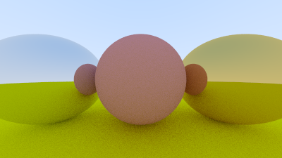

# Overview

Peter Shirley's raytracing tutorials updated to C++ modules, while taking advantage of more recent language features.

The current state being generated is,

# Security

I have tried to write the code using C++ best practices for secure code, as means to prove it is possible to have fast code while going safe.

Naturally, there might be hidden dragons still lying around the code.

# License

Given that the code is based on Peter Shirley's work, I have adopted the same license.

